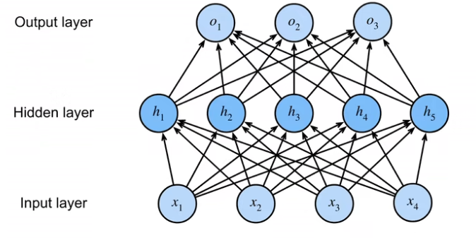

# 感知机（perception）

给定输入x，权重w和偏移b，x和w都是向量，b是标量

$$
o=\sigma (\langle w,x\rangle+b) \\ 
\sigma(x) = 
\begin{cases}
1 & \text{$x>0$}\\
0 & otherwise
\end{cases}
$$

sigma有很多选择，大部分是二分类问题，可以是1，-1,0随机选择，对单元素输入做二分类，是离散的类，与softmax的n分类不同

### 训练过程

$$
\begin{aligned}&\textbf{initialize }w=0\mathrm{~and~}b=0\\&\mathrm{repeat}\\&\mathbf{if}y_i\left[\langle w,x_i\rangle+b\right]\leq0\mathrm{~then}\\&w\leftarrow w+y_ix_i\mathrm{~and~}b\leftarrow b+y_i\\&\mathrm{end~if}\\&\textbf{until all classified correctly}\end{aligned}
$$

小于等于0 即分类错误，说明当前的权重w错误，则更新w和b（学习权重和偏置），条件为**全部类都分类正确**

等价于使用批量大小为1的梯度下降，使用如下损失函数

$$
\ell(y,\mathbf{x},\mathbf{w})=\max(0,-y\langle\mathbf{w},\mathbf{x}\rangle)
$$

并不是随机的，而是一个一个的扫描（梯度下降有随机的）

其中max对应的if语句，如果分类正确是0，否则是-的，需要进行更新

收敛定理

是否真的能够停止—能否达到停止条件

- 设所有的数据均在半径r内
- 设余量/rho 分类两类
    
    $$
    y(\mathbf{x}^\top\mathbf{w}+b)\geq\rho\text{对于 }\|\mathbf{w}\|^2+b^2\leq1
    $$
    
- 则感知机保证在(r^2+1)/(/rho ^2)步后收敛

$$
\frac{r^2+1}{\rho^2}
$$

问题

无法拟合XOR函数，即感知机智能产生线性分割面，而不能产生曲线

总结：

- 感知机是一个二分类模型
- 等价于批量为1的梯度下降模型
- 无法拟合XOR模型

多层感知机（Multilayer-Preception )

通过设计多层感知机（每一个单独的感知机是一个二分类器），然后对所有感知机的结果进行运算，得到相关的值



可以认为隐藏层的参数是超参数（人为设定的，无法由机器自主学习得到的）

先考虑单分类分体，m是隐藏层的维度，h和softmax一样

$$
input:\mathbf{x}\in\mathbb{R}^n\\
hidden\space layer:\mathbf{W}_1\in\mathbb{R}^{m\times n},\mathbf{b}_1\in\mathbb{R}^m\\
output \space layer \space \mathbf{w}_2\in\mathbb{R}^m,b_2\in\mathbb{R}\\
\begin{aligned}
&\mathbf{h}=\sigma(\mathbf{W}_1\mathbf{x}+\mathbf{b}_1)\\&o=\mathbf{w}_2^T\mathbf{h}+b_2
\end{aligned}
$$

/sigma 是按元素的激活函数 o是输出

激活函数式非线性的才可以，否则输出o也是线性的—仍然无法解决XOR问题—退化为一个由多个单层的感知机堆积而成的感知机

常用的激活函数（除了上面的阶跃）

可以是作为一个软的阶跃函数，将输入全部都映射到0-1之间

$$
\mathrm{sigmoid}(x)=\frac{1}{1+\exp(-x)}
$$

其他的还有tanh，ReLu函数

ReLu：rectified linear unit （整流线性）将其作为一个非线性函数 好处是简单，计算快

$$
\mathbf{ReLu} = max(x,0)
$$

多类问题和之前的softmax多分类一致：

$$
y_1,y_2,...,y_k=\mathrm{softmax}(o_1,o_2,...,o_k)
$$

比softmax多了一个影藏层，则最后的多分类感知机

$$
input:\mathbf{x}\in\mathbb{R}^n\\
hidden\space layer:\mathbf{W}_1\in\mathbb{R}^{m\times n},\mathbf{b}_1\in\mathbb{R}^m\\
output \space layer \space \mathbf{w}_2\in\mathbb{R}^{m\times k},b_2\in\mathbb{R}^k\\
\begin{aligned}
&\mathbf{h}=\sigma(\mathbf{W}_1\mathbf{x}+\mathbf{b}_1)\\&o=\mathbf{w}_2^T\mathbf{h}+b_2\\
&y=softmax(o)
\end{aligned}
$$

可以设置多隐藏层：

$$
\begin{gathered}\mathbf{h}_1=\sigma(\mathbf{W}_1\mathbf{x}+\mathbf{b}_1)\\\mathbf{h}_2=\sigma(\mathbf{W}_2\mathbf{h}_1+\mathbf{b}_2)\\\mathbf{h}_3=\sigma(\mathbf{W}_3\mathbf{h}_2+\mathbf{b}_3)\\\mathrm{0}=\mathbf{W}_4\mathbf{h}_3+\mathbf{b}_4\end{gathered}
$$

激活函数用来避免层数塌陷，最后一层不需要隐藏层

超参数： 

- 隐藏层层数
- 每层影藏层大小—有多个节点（一般是压缩，即后面的层数比前面的层数小—用于压缩）


总结：

- 多层感知机使用隐藏层和激活函数来得到非线性模型—可以解决非线性问题如XOR
- 常用激活函数Sigmoid,Tanh,ReLU
- 使用Softmax来处理多分类问题
- 超参数为隐藏层数和各个隐藏层大小

代码实现

```python
num_inputs, num_outputs, num_hiddens = 784, 10, 256

#权重W1和W2的值为随机值，b1和b2的值为0
#第一层输入和隐藏层，则w1有inputs*hiddens个
W1 = nn.Parameter(torch.randn(num_inputs, num_hiddens, requires_grad = True))
#第一层的偏置是对于隐藏层的偏置，所以只用设hiddens个
b1 = nn.Parameter(torch.zeros(num_hiddens, requires_grad = True))
#第二次连接隐藏层和最后一层，所以个数是hiddens*outputs个
W2 = nn.Parameter(torch.randn(num_hiddens, num_outputs, requires_grad=True))
#最后一层的偏置是结果的偏置
b2 = nn.Parameter(torch.zeros(num_outputs, require_grad=True))

params = [W1,b1,W2,b2]

def relu(X):
	a= torch.zeros_like(X)
	return torch.max(X,a)

def net(X):
	X = X.reshape((-1, num_inputs))
	#矩阵乘法@
	H = relu(X @ W1 + b1)
	return (H @ w2 + b2)

#损失为交叉熵
loss = nn.CrossEntropyLoss()

#训练过程和softmax完全相同
num_epochs, lr = 10 , 0.1
updater = torch.optim.SGD(params, lr=lr)
d2l.train_ch3(net, train_iter, test_iter, loss, num_epochs,updater)

```

相比于softmax，其损失更小，精度差别不大

简洁实现—通过高级API更简洁的视线多层感知机

```python
#和MLP的结果一样
#和后面许多的转化更容易
import torch
from torch import nn
from d2l import torch as d2l

net = nn.Sequential(
			nn.Flatten(), #输入作为三维
			nn.Linear(784,256), #第一层是线性层，输入为784，输出位256--暗含第一次隐藏层是256
			nn.ReLU(), nn.Linear(256,10))#激活函数式ReLU，最后一层256对10--输出10

#初始化权重
#如果是线性层，则对其归一化
def init_weights(m):
		if type(m) == nn.Linear
			nn.init.normal_(m.weight, std=0)
			
net.apply(init_weights);
			
#训练过程
num_epochs, lr ,batch_size= 10 , 0.1, 256
loss = nn.CrossEntropyLoss()
trainer = torch.optim.SGD(net.parameters(), lr=lr)
train_iter, test_iter = d2l.load_data_fashion_mnist(batch_size, num_epoch))
d2l.train_ch3(net, train_iter, test_iter, loss, num_epochs,updater)

```

QA：

- 一层视作包含激活函数的一层—能够学习的层数（包含w和b的层数）
- /rho 和r 是统计学的概念，机器学习中不关心—即只用知道收敛定理能够收敛即可
- 感知机未推广—超参数定义，优化不方便（不好调），SVM（数学和调节好）和MLP的效果差不多一样下选择用数学更好的SVM
- 在选择层数和层神经元个数时，尽可能选择层数较深的—可视作深度学习（浅的—层数少，单层神经元个数多的网络容易过拟合）深度比宽度好，没有最优解
- ReLU不是线性函数，可以视作是引入了非线性—选择不同的激活函数本质一样，只对梯度有影响
- 训练完后参数是固定的，不能是动态的—可能会导致有抖动，使得分类不准确